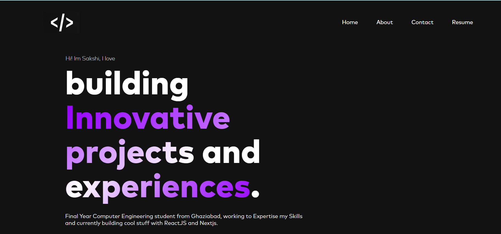
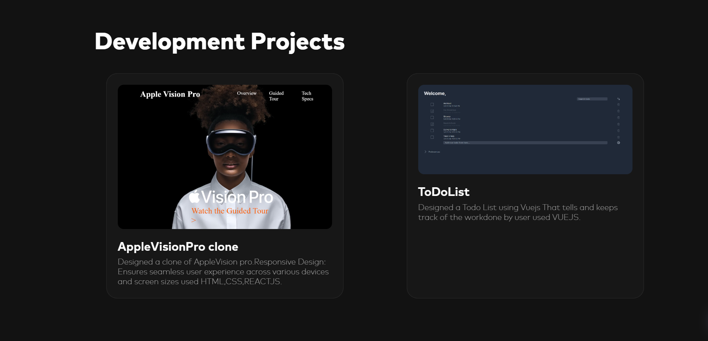
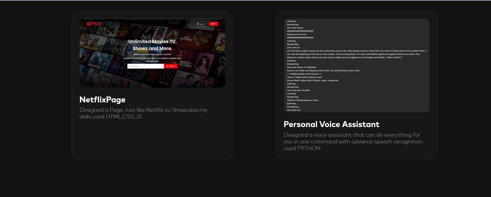

# MyPortfolio
 A Simple Portfolio made using Nextjs and TailwindCSS .
 
## Development

`npm install` - Install required npm packages for development.

`npm run dev` - Required command for development.

`npm run build` - Take a build for production step.

`npm run preview` - Required to see the last status of your project.
## Screenshots

